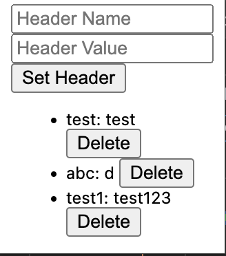
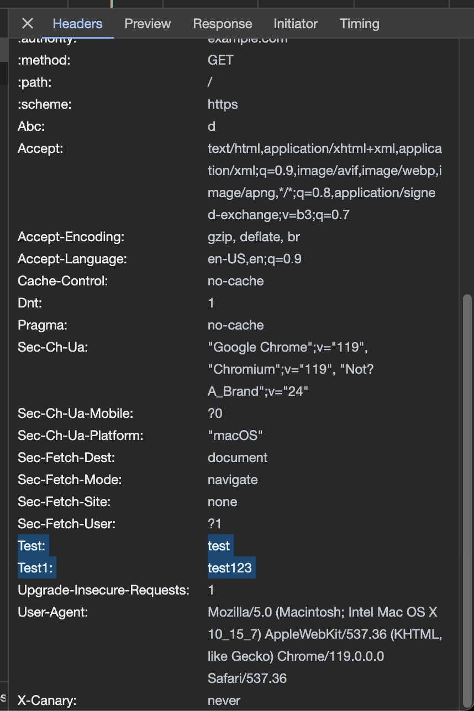

* Arbitrary Header Extension

- You pick and add headers to all your outgoing requests. I wrote this because the other one https://chromewebstore.google.com/detail/modheader-modify-http-hea/idgpnmonknjnojddfkpgkljpfnnfcklj seems to inject ads and the other https://chromewebstore.google.com/detail/requestly-open-source-htt/mdnleldcmiljblolnjhpnblkcekpdkpa seems to have a goddamn product hunt page.

* Usage
- Use by cloning -> chrome://extensions/ -> load unpacked.
